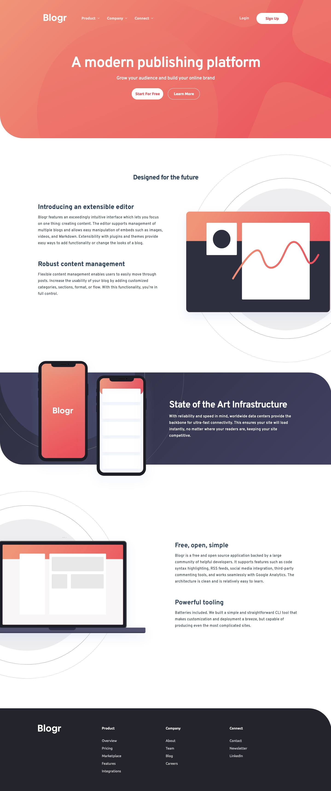

# Blogr landing page solution

This is a solution to the [Blogr landing page challenge on Frontend Mentor](https://www.frontendmentor.io/challenges/blogr-landing-page-EX2RLAApP). Frontend Mentor challenges help you improve your coding skills by building realistic projects.

## About the Project

Welcome to the "Blogr Landing Page" challenge from Frontend Mentor. This project presents a landing page for Blogr, a blogging platform, utilizing HTML for structure, CSS/Scss for styling, and JavaScript to manage the functionality of the mobile navigation and individual subnavs. The design focuses on a clean, user-friendly interface that promotes Blogr's features.

## Preview and Links

<b>Open Preview</b>

 

 

| [Live Demo URL](https://ionstici.github.io/blogr-landing-page) | [Frontend Mentor](https://www.frontendmentor.io/solutions/blogr-landing-page-_lmou3r99w) |
| -------------------------------------------------------------- | ---------------------------------------------------------------------------------------- |

## Features

- **Responsive Design:** Ensures optimal viewing experience across all devices, adapting seamlessly to different screen sizes.
- **Mobile Navigation:** JavaScript enhances the user experience by toggling the mobile navigation menu, making it accessible on smaller screens.
- **Subnav Functionality:** JavaScript also handles individual subnavs, providing an interactive navigation experience.
- **Modern Aesthetic:** Uses CSS/Scss to create a fresh, modern look that reflects Blogr's innovative approach to blogging.

## Tech Stack

- **HTML5:** Provides the semantic layout for the landing page.
- **CSS3 with Scss:** For efficient styling, leveraging Scss for better management of styles through variables, mixins, and nested rules.
- **JavaScript:** To dynamically control the mobile navigation and subnav functionality, ensuring an interactive user experience.
